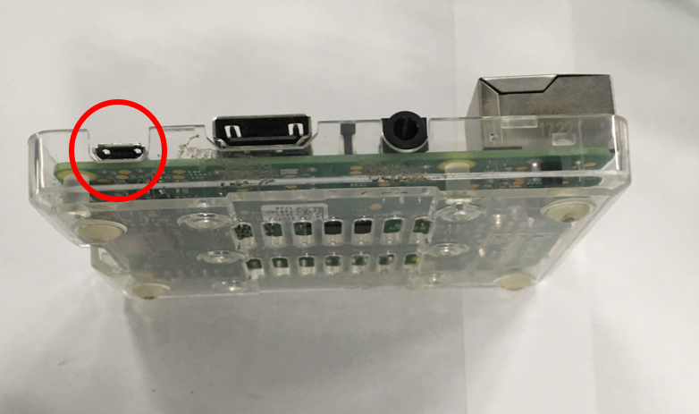
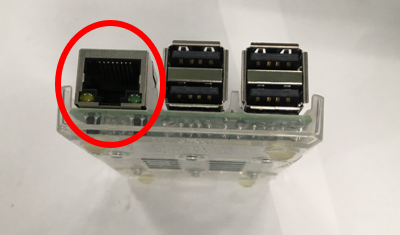
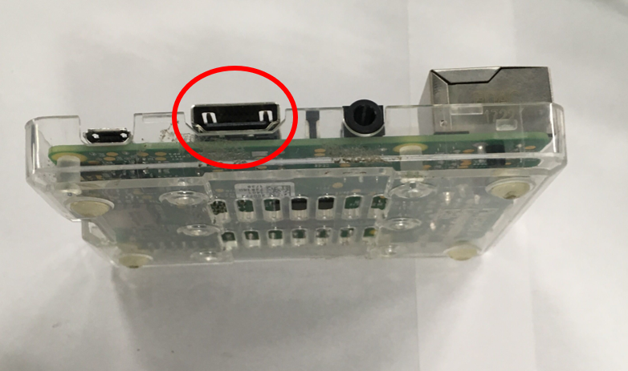
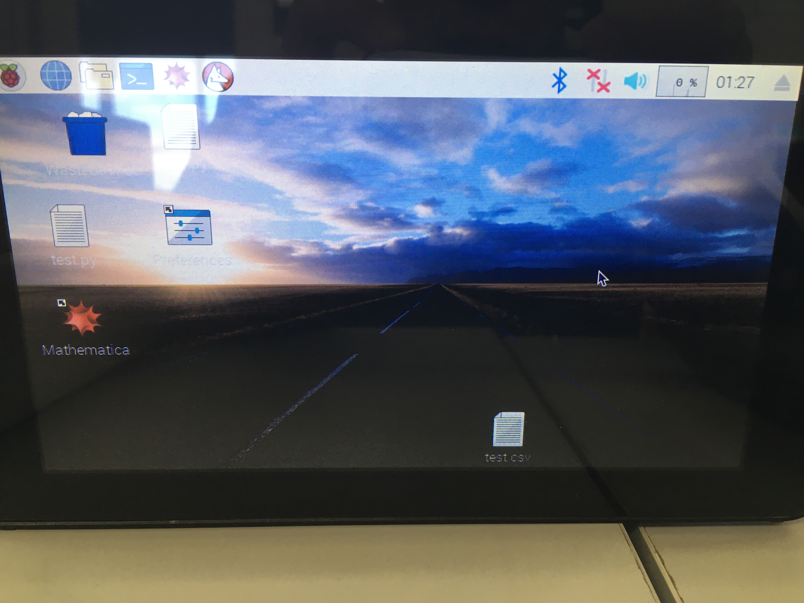
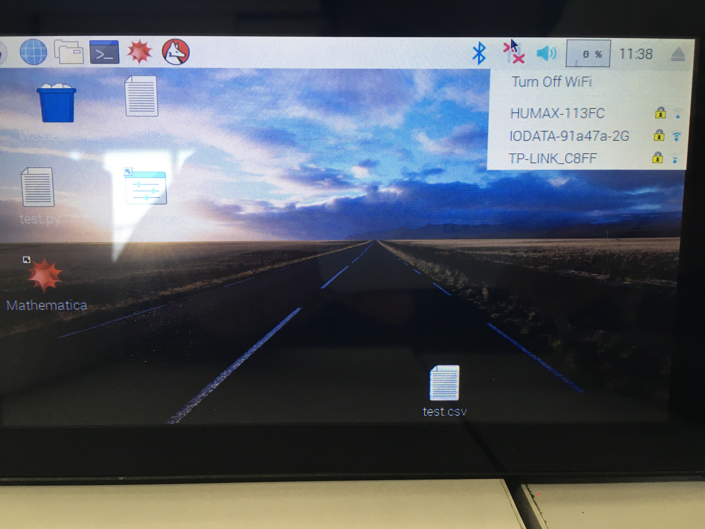
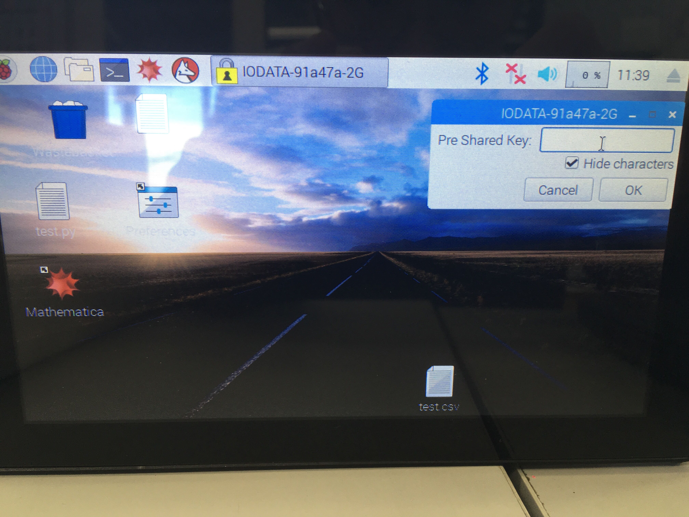

# Raspberry Piの設定


## 電源の接続

下のRaspberryPiの電源ポートに付属のUSB-typeBケーブルを挿し、コンセントに接続すればRaspberry Piは起動します。

<div align="center">

</div>

## インターネット接続

センサのデータをクラウドに送信する際は、インターネット接続を行う必要があります。

### 有線接続をする場合

本体側面にあるLANポートにネットワークケーブルを差し込んでください。

<div align="center">

</div>

### 無線接続を行う場合

本体側面にあるHDMIポートにケーブルを、USBポートにマウスとキーボードを接続し、ディスプレイを接続してください。なお、Bluetoothが使えるため、マウスとキーボードは無線のものを使うことができます。

<div align="center">

</div>

その後、電源を入れます。<u>電源ケーブルを接続する前にHDMIケーブルの接続を行わないと、ディスプレイには何も表示されないので注意してください。</u>

しばらくすると、以下のような画面に遷移します。

<div align="center">

</div>

Bluetoothマークの横のマークをクリックします

普段使用しているWi-Fiのアクセスポイントを選択します。

<div align="center">

</div>

パスワードを入力します。

<div align="center">

</div>

以上でネットワークの接続は終わりです。
弊社からRaspberryPiを購入した場合、ネットワークに接続すればセンサのデータはクラウドに送信され始めます。

## 自分でRaspberry Piの設定を行う

ご自分でRaspberry Piの設定を行う際は、以下のとおりに設定してください。ここでは、USBメモリにデータを保存する設定（初期設定）を取り扱います。
セットアップが完了した受信機と、USBメモリをUSBをRaspberry Piに接続し、電源を入れます。

1. まず、ターミナルからgitをインストールします。

    ```sh
    sudo apt -y update
    sudo apt -y install git
    ```

2. 次に、本リポジトリをクローンします。

    ```sh
    git clone https://github.com/Tycoh/C3less-Sensor.git
    ```

3. セットアッププログラムを実行します

    ```sh
    cd C3lessSensorService
    chmod +x setup.sh
    bash setup.sh
    ```

4. 再起動後、センサのデータが蓄積していることを確認します。

    ```sh
    less /media/pi/*/data.csv
    ```

データが確認できない場合は、[トラブルシューティング](../troubleshooting/troubleshooting.md)をご覧ください。

