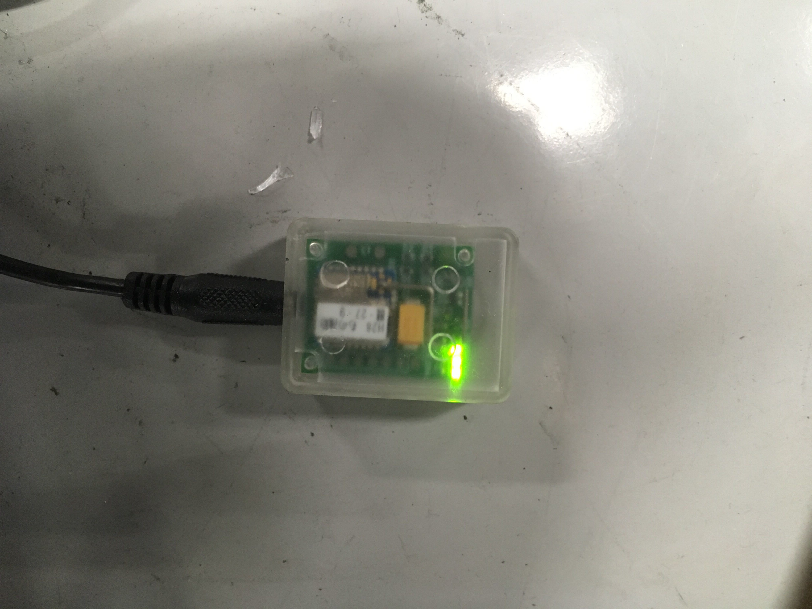
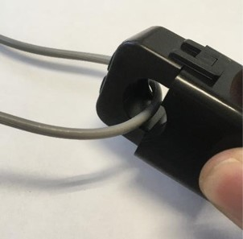
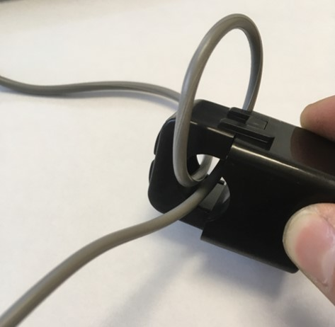
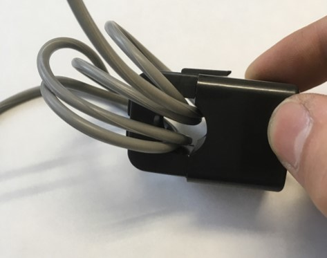

# センサを設置する

次にセンサを設置します。いずれの場合も、センサに搭載されているLEDが光れば動作が確認できます。

## クランプ式センサの設置方法

センサを設置後、送信機のLEDが以下のように光ることを確認してください。LEDが光らない場合、データの送信に必要な電力が足りていない可能性があります。

### 良い例

以下の写真は低電力用クランプセンサで単相2線式電線のうちの一本をクランプした際のものです。

以下の写真は、中電力用クランプセンサで単相3線式電線のうちの一本をクランプした際のものです。

## 動作電流以上の電流が流れていないときの対処法

以下のように、線を1回巻き、2本分の線をクランプすることで、電線に流れている電流の2倍の値を得ることができます。

また、巻き数を増やし、クランプする線の本数を増やすことで、定数倍の値を得ることができます。例えば、以下の画像では、5本の線をクランプしているため、センサは電線に流れている電流値の5倍の電流値を得ています。

## 貫通式センサの設置方法

貫通式のセンサは、以下の二通りの使い方があります。

1. 2つに分割されている電源タップを作成する

2. コンセント裏に仕込む

(注意：この工事には2種電気工事士が必要です。)