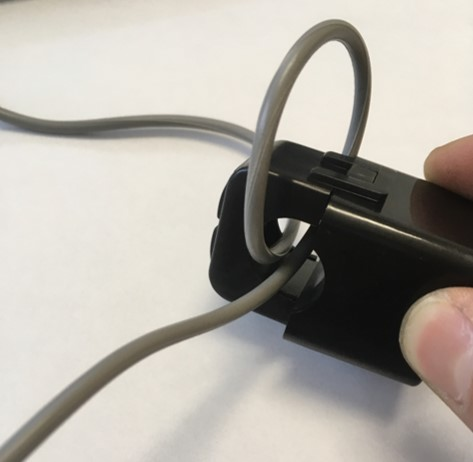

# クイックスタートガイド

## 概要

本ページでは、本プログラムを動作させるために最低限必要な手順を紹介します。
ここでは、Raspberry Pi上でUSBメモリにデータを保存する方法[^1]を紹介します。

## 設定

### 受信機の設定

インタラクティブモードで受信機プログラムを書き込んだTweliteの値を、次のように設定します。

|設定項目|値|
| - | - |
|ApplicationID|子機側と同じ値|
|Optionbit|0x00000020|

設定項目の詳細は、[MONOWIRELESSのホームページ](https://mono-wireless.com/jp/products/TWE-APPS/App_Tag/interactive.html#parent)をご覧ください。

## センサを設置する

次にセンサを設置します。いずれの場合も、センサに搭載されているLEDが光れば動作が確認できます。

### クランプ式センサの設置方法

センサを設置後、送信機のLEDが以下のように光ることを確認してください。LEDが光らない場合、データの送信に必要な電力が足りていない可能性があります。


#### 良い例
以下の写真は低電力用クランプセンサで単相2線式電線のうちの一本をクランプした際のものです。

<div align="center">

</div>

以下の写真は、中電力用クランプセンサで単相3線式電線のうちの一本をクランプした際のものです。

### 動作電流以上の電流が流れていないときの対処法

以下のように、線を1回巻き、2本分の線をクランプすることで、電線に流れている電流の2倍の値を得ることができます。

<div align="center">

</div>

また、巻き数を増やし、クランプする線の本数を増やすことで、定数倍の値を得ることができます。例えば、以下の画像では、5本の線をクランプしているため、センサは電線に流れている電流値の5倍の電流値を得ています。

<div align="center">

</div>


### 貫通式センサの設置方法

貫通式のセンサは、以下の二通りの使い方があります。

1. 2つに分割されている電源タップを作成する


2. コンセント裏に仕込む

(注意：この工事には2種電気工事士が必要です。)

## USBメモリの設定

初期設定では、本プログラムはセンサから得たデータを、USBメモリ(/media/pi/*)に保存する構成となっています。
CUIをご利用の方は、USBメモリを手動でマウントする必要があります。

## Raspberry Piの設定

セットアップが完了した受信機と、USBメモリをUSBをRaspberry Piに接続し、電源を入れてください。

1. まず、gitをインストールします。

    ```sh
    sudo apt -y update
    sudo apt -y install git
    ```

2. 次に、本リポジトリをクローンします。

    ```sh
    git clone https://github.com/Tycoh/C3less-Sensor.git
    ```

3. セットアッププログラムを実行します

    ```sh
    cd C3lessSensorService
    chmod +x setup.sh
    bash setup.sh
    ```

4. 再起動後、センサのデータが蓄積していることを確認します。

    ```sh
    less /media/pi/*/data.csv
    ```

データが確認できない場合は、[トラブルシューティング](../troubleshooting/troubleshooting.md)をご覧ください

[^1]: 初期設定