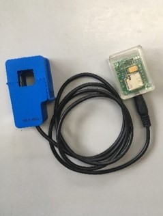

# センサを登録する

この項目では、センサの登録方法を記述します。そのために、

Raspberry Pi上では、以下のコマンドから編集できます。

```sh
nano ~/C3lessSensorSystem/sensorSystem/sensor-data.yml
```


## ファイルの構造

上記のコマンドを実行すると、以下ようなファイルが表示されます。予め登録されているセンサは、テスト用のセンサです。

```yaml
Items:
    -
        sensorSN: 1033caa
        sensorType: ClampCurrentSensor2-100A
        Unit: Ampere
    
```

ここで、各項目は以下のような意味を持ちます。

1. Items :
センサデータのリスト

2. sensorSN:
センサのシリアル番号

3. sensorType:
[センサの命名法](sensor-name.md)で規定されるセンサの種類。現在、以下の種類がサポートされています。

- ClampCurrentSensor2-100A
  - 中電流用クランプ式電流センサ

<div align="center">

</div>

- ClampCurrentSensor0.6-20A
  - 小電流用クランプ式電流センサ

<div align="center">

</div>

- TransfixedCurrentSensor0.06-20A
  - 小電流用貫通式電流センサ

<div align="center">

</div>

- TCTemperatureSensor
  - 熱電対センサ

4. Unit: 
センサの単位。

## センサの登録方法

センサは、ファイルの一部をコピー&ペーストすることで登録することができます。
コピー&ペーストする部分は次の行です。

ここでは、例としてシリアル番号が`1234567`の熱電対センサを登録する

```yaml
Items:
#この行から
    -
        sensorSN: 1033caa
        sensorType: ClampCurrentSensor2-100A
        Unit: Ampere
#この行までコピーします
```

コピーしたら、ファイルの末尾に貼り付けます。


```yaml
Items:
    -
        sensorSN: 1033caa
        sensorType: ClampCurrentSensor2-100A
        Unit: Ampere
    -
        sensorSN: 1033caa
        sensorType: ClampCurrentSensor2-100A
        Unit: Ampere
    
```

貼り付けたら、各項目を編集します。
今回のセンサは、シリアル番号が`1234567`、センサの種類が熱電対センサ(=`TCTemperatureSensor`)、単位はセルシウス度`Celsius Degree`です。

この場合、各項目は以下のように編集します。

```yaml
Items:
    -
        sensorSN: 1033caa
        sensorType: ClampCurrentSensor2-100A
        Unit: Ampere
    -
        sensorSN: 1234567
        sensorType: TCTemperatureSensor
        Unit: Celsius Degree
    
```

## 悪い例

ファイルを編集後、エラーが発生する場合は、以下の項目を確認してください。

### インデントが不正

コピーアンドペーストの際に、ハイフンの位置がずれてしまうことがあります。インデントが揃っていないと、ファイルを正常に読み込むことができません。インデントは必ず揃えるようにしてください。

```yaml
Items:
    -
        sensorSN: 1033caa
        sensorType: ClampCurrentSensor2-100A
        Unit: Ampere
- #スペースがない
        sensorSN: 1234567
        sensorType: TCTemperatureSensor
        Unit: Celsius Degree
    
```


```yaml
Items:
    -
        sensorSN: 1033caa
        sensorType: ClampCurrentSensor2-100A
        Unit: Ampere
   - #スペースが一つ足りない  
        sensorSN: 1234567
        sensorType: TCTemperatureSensor
        Unit: Celsius Degree
    
```

### 全角スペースを使っている

ファイル内に全角スペースが入ると、ファイルを正常に読み込むことができない場合があります。
```yaml
Items:
    -
        sensorSN: 1033caa
        sensorType: ClampCurrentSensor2-100A
        Unit: Ampere
    -  
        sensorSN: 1234567
        sensorType: TCTemperatureSensor
        Unit: Celsius Degree　#末尾に全角スペースが入っている
    
```

### タブ文字を使っている

インデントを、スペースではなくタブ文字を使って入力するとエラーの原因になります。


