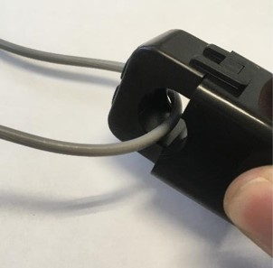

# センサを確認する

データが正常に取れていないときは、まずセンサのLEDが点灯しているか確認してください。

LEDが光ってる際は、次の[ハードウェアを確認する]を参照してください。

ここで、LEDが光っていなければ、センサからデータが送信されていない可能性があります。
以下の事項を確認してください。

## 電線に動作電力以上の電流が流れていることを確認する

市販のクランプセンサなどを用いて、電線に動作電力以上の電流が流れていることを確認してください。

また、動作電流以上の電流が流れていても、電線に計測電流以上の電流が流れていなければ正確なデータが計測できない場合があります。

動作電流や計測電流以上の電流が流れていない箇所を計測する際は、ケーブルの巻数を増やすことで、電流値を巻き数倍にすることが可能です。

### 例：
以下の写真は低電力用クランプセンサで単線をクランプした際のものです。

以下のように、線を1回巻き、2本分の線をクランプすることで、電線に流れている電流の2倍の値を得ることができます。

また、巻き数を増やし、クランプする線の本数を増やすことで、定数倍の値を得ることができます。例えば、以下の画像では、5本の線をクランプしているため、センサは電線に流れている電流値の5倍の電流値を得ています。

